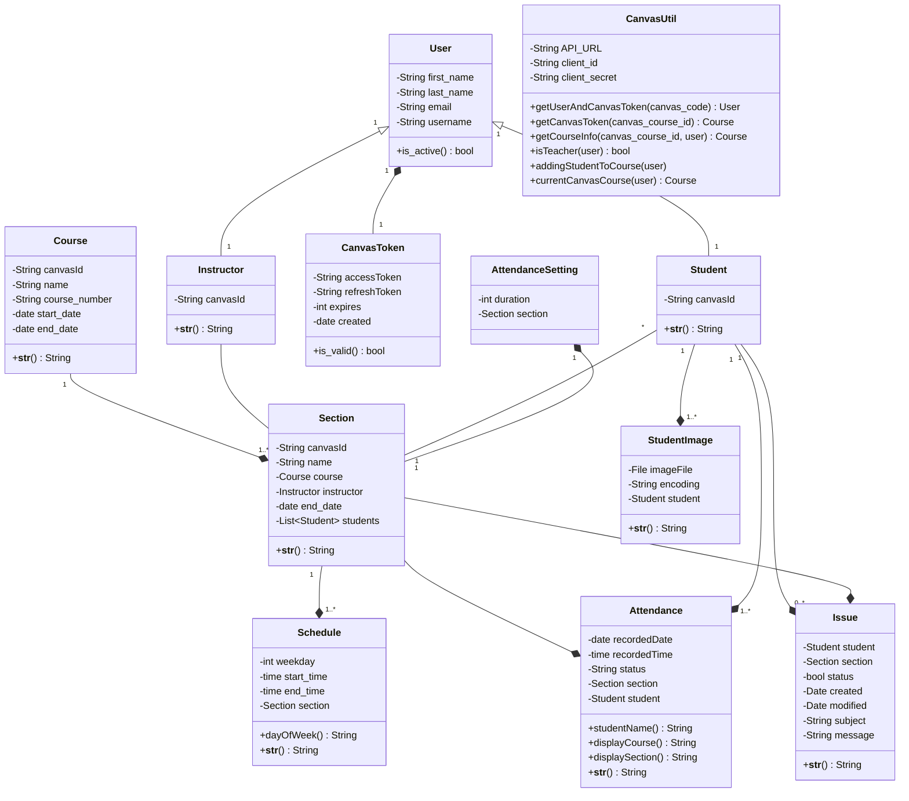

**Purpose**

The Design Document - Part I Architecture describes the software architecture and how the requirements are mapped into the design. This document will be a combination of diagrams and text that describes what the diagrams are showing.

**Requirements**

The Design Document - Part I Architecture will contain:

A description the different components and their interfaces. For example: client, server, database.

For each component provide class diagrams showing the classes to be developed (or used) and their relationship.

## UML Class Diagram

## Entity-Relation Diagram

## Sequence Diagrams

### Sequence Diagram for Use Case #1

1. User Story:
As a new student using the attendance face recognition system for the first time, I want to access the attendance. 

Use Case:
- If the user is a new student, they login to canvas using their credentials
- They click on attendance from the navigation menu on the left
- They authorize the access of the AFR application
- They then upload a few pictures of themself to add to the data set
- Once finished, they can go to home and click on take attendance
- The student gives permission for the application to use the camera and record their attendance
- Once the attendance is recorded, they can exit out of the application

### Sequence Diagram for Use Case #2

2.	User story:
As an enrolled student, I can directly login through canvas and use it for attendance. 

Use case:
-	If the user is a student, they login to canvas using their credentials
- They click on attendance from the navigation menu on the left
- The student clicks on take attendance
- The student gives permission for the application to use the camera
-	The student looks at the camera
-	The system matches the face
-	The system marks the attendance as present

### Sequence Diagram for Use Case #3

3. User Story: 
As a student, if I’m unable to get my attendance recorded after multiple attempts, I want an alternative method to verify my presence and let the professor know that I'm in class. 

Use Case:
If the user is a student, they login to canvas using their credentials
- They click on attendance from the navigation menu on the left
- The student clicks on take attendance
- The student gives permission for the application to use the camera
-	Then the student looks at the camera to record the attendance
-	The system has trouble recognizing the student and displays error message, even after multiple tries
-	The student then clicks the ‘Need Help’ button to report the issue to the professor
-	The professor gets notified that the specific student user has an issue marking their attendance

### Sequence Diagram for Use Case #4

4.	User story:
As a professor, I want to have attendance taken automatically at a specific time of the class. 
 Use case:
-	An admin user signs in through canvas
-	They click on attendance from the navigation menu on the left
-	As they are redirected to the home page, they select the desired class
-	Next, they set a recurring days and time for attendance during beginning of the semester
-	The system opens the attendance automatically to each student for that set time every class

### Sequence Diagram for Use Case #5

5.	User story:
As a professor, I want to have real time access of the attendance and get a report of the students’ attendance. 

Use case: 
-	An admin user signs in through canvas
-	They click on attendance from the navigation menu on the left
-	As they are redirected to the home page and once the class is finished, they click on the 'Reports' tab
-	Then they select a specific class to view the report
-	Once selected, the report can be seen
-	If they want to make any adjustments, they can click on ‘Record manually’ to make changes

### Sequence Diagram for Use Case #6

6. User Story:
As a professor, I want to be notified/informed if any student has issues taking attendance. 

Use Case:
-	An admin user signs in through canvas
-	They click on attendance from the navigation menu on the left
-	As they are redirected to the home page, they click on the 'Issues' tab
-	They can see the issues reported by the students from different classes and sections
-	They can click to view the issues

