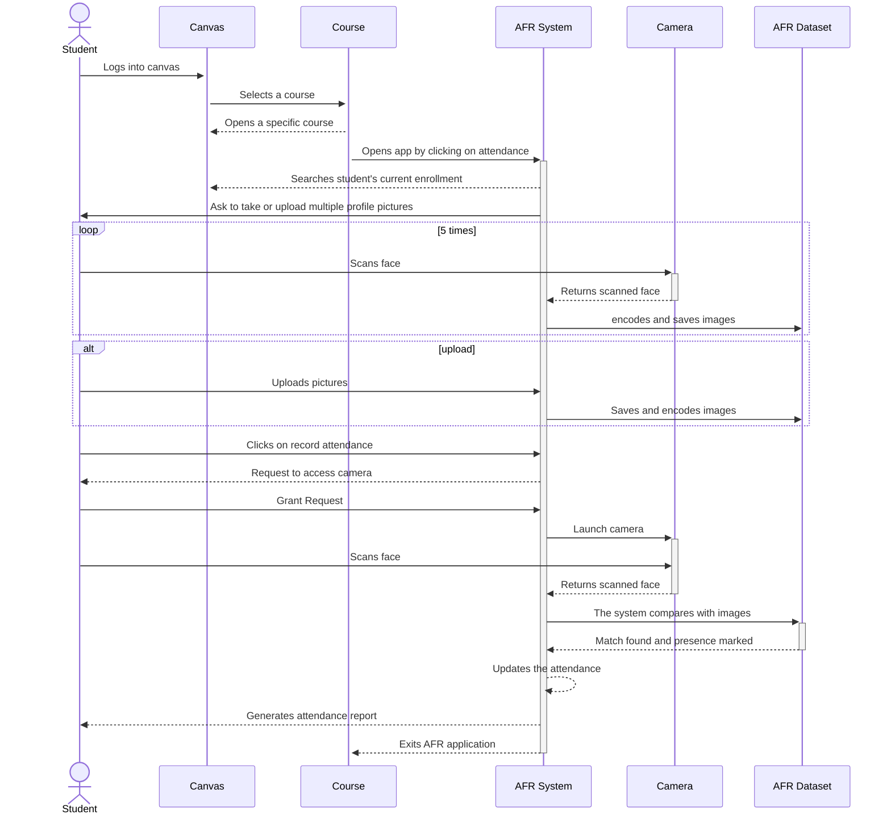
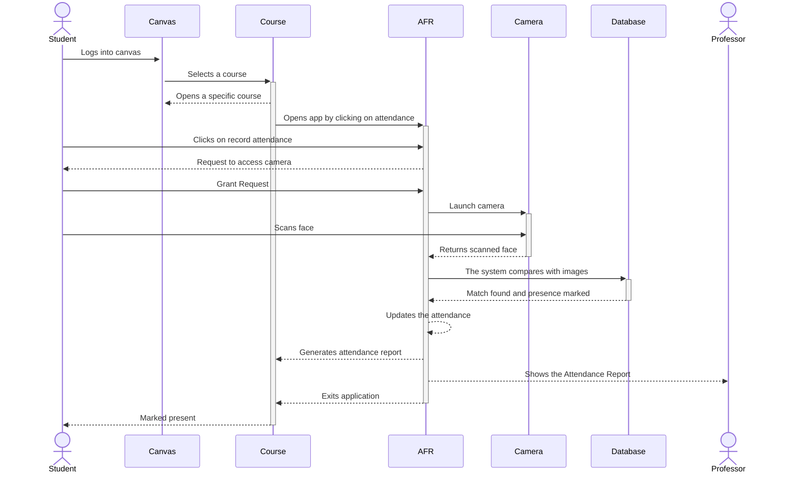
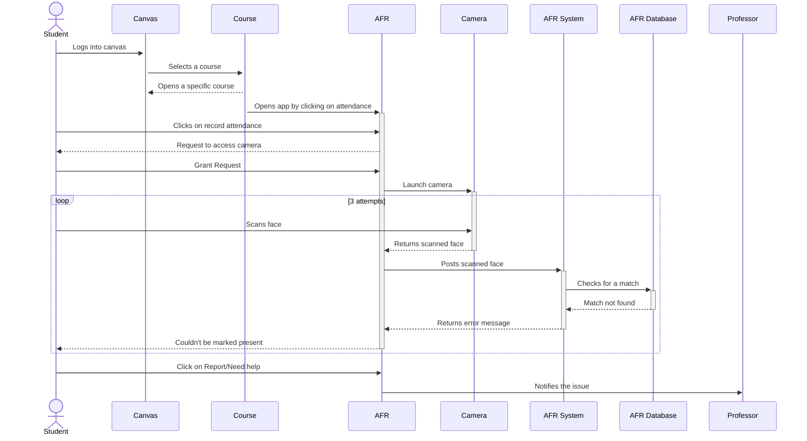
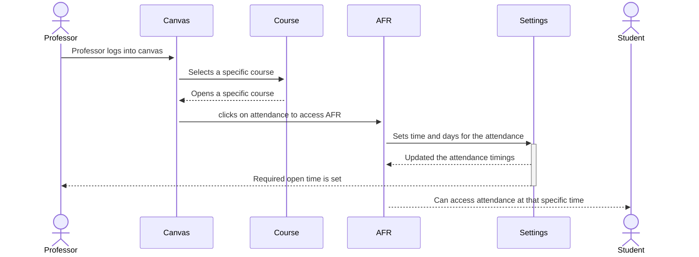
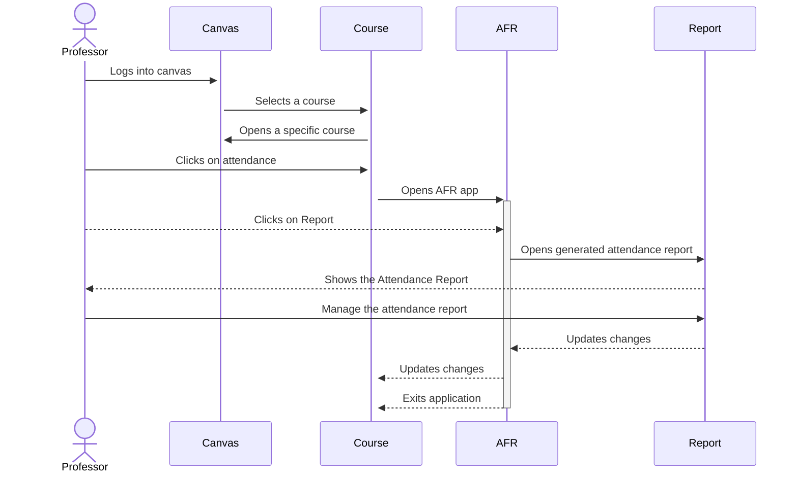
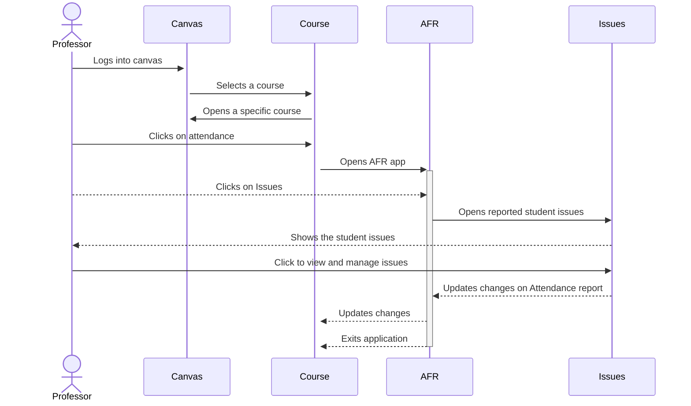
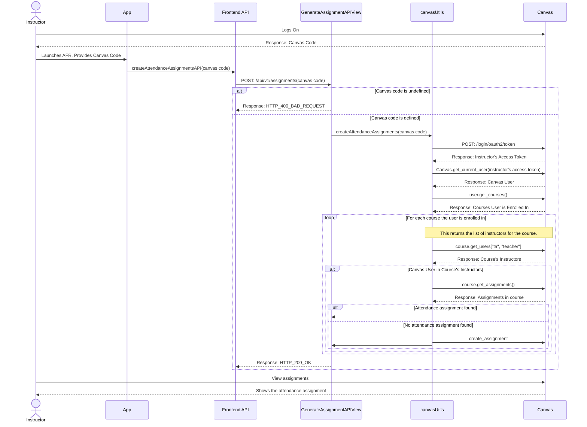
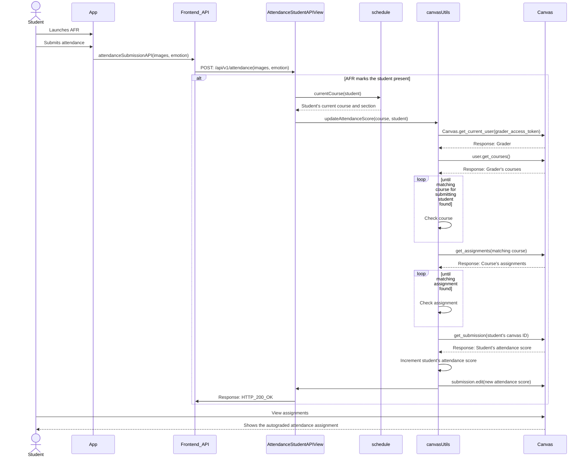

**Purpose**

The Design Document - Part I Architecture describes the software architecture and how the requirements are mapped into the design. This document will be a combination of diagrams and text that describes what the diagrams are showing.

## UML Class Diagram
Many of the classes illustrated in the UML class diagram represent models that define the source of information about AFR data. It includes a representation of the user, course, section, schedule, image, and tickets that will be used to generate a table in the AFR database. This will not be possible without this ORM feature provided by the Django framework. Even if these classes are placed in different apps in the project, they are all connected in a way to properly run the AFR Application. The other classes included in the application help in creating business logic in order to properly handle the information from Canvas and match it with the appropriate user. 

## Entity-Relation Diagram
The AFR database is an essential piece to allow this application to function. It consists of thirteen tables that store information about AFR's users and the courses found in Canvas for a particular user. A user can be either a student or a professor. Each user will have a stored token that will be created as the user first logs into the application. That token will be retrieved every time a user requests access to the application.
As a student, AFR stores a reference to the user id found in Canvas to retrieve and update any changes that was done on the Canvas platform. Since AFR is a face recognition application, a student has the possibility to store more than one encoded image which will facilitate the authentication of the user once he/she is trying to mark themselves PRESENT in a particular class. A special table called “attendance_Issue” will store any submitted ticket created by a student once there is a concern in taking attendance, such as if the application is unable to detect their face.
Students will not be able to explore AFR's complete features if their professor does not properly configure the section prior to the beginning of the semester. For the app to work accurately for each student, AFR stores all sections' configurations that will be retrieved once a student is trying to take attendance.

## Sequence Diagrams

### Sequence Diagram for Use Case #1

1. User Story:
As a new student using the attendance face recognition system for the first time, I want to access the attendance. 

Use Case:
- If the user is a new student, they login to Canvas using their credentials
- They click on "Attendance Face Recognition" from the navigation menu on the left
- They authorize the access of the AFR application
- They then upload a few pictures of themself to add to the data set
- Once finished, they can go to the home page of AFR and click on 'take attendance'
- The student gives permission for the application to use their camera and record their attendance
- Once the attendance is recorded, they can exit out of the application

### Sequence Diagram for Use Case #2

2.	User story:
As an enrolled student, I can directly login through Canvas and use it for attendance. 

Use case:
- If the user is a student, they login to Canvas using their credentials
- They click on "Attendance Face Recognition" from the navigation menu on the left
- The student clicks on 'take attendance'
- The student gives permission for the application to use their camera
- The student looks at the camera
- The system matches the face
- The system marks the student's attendance status as present

### Sequence Diagram for Use Case #3

3. User Story: 
As a student, if I’m unable to get my attendance recorded after multiple attempts, I want an alternative method to verify my presence and let the professor know that I attended class. 

Use Case:
- If the user is a student, they login to Canvas using their credentials
- They click on "Attendance Face Recognition" from the navigation menu on the left
- The student clicks on 'take attendance'
- The student gives permission for the application to use the camera
- Then the student looks at the camera to record their attendance
- The system has trouble recognizing the student and displays an error message, even after multiple tries
- The student then clicks the ‘Need Help’ button to report the issue to the professor
- The professor gets notified that the specific student user has an issue marking their attendance

### Sequence Diagram for Use Case #4

4.	User story:
As a professor, I want to have attendance taken automatically at a specific time of the class. 
 Use case:
- An admin user signs in through Canvas
- They click on "Attendance Face Recognition" from the navigation menu on the left
- As they are redirected to the professor view home page, they select their desired class
- Next, they set a class schedule with specific recurring days of the week, along with the class time and start/end dates for attendance during beginning of the semester
- The system opens the attendance automatically to each student for that set time every class

### Sequence Diagram for Use Case #5

5.	User story:
As a professor, I want to have real time access of the attendance and get a report of the students’ attendances. 

Use case: 
- An admin user signs in through Canvas
- They click on "Attendance Face Recognition" from the navigation menu on the left
- As they are redirected to their home page and once the class is finished, they click on the 'Reports' tab
- Then they select a specific class for which to view the report
- Once selected, the attendance report can be seen
- If they want to make any adjustments, they can click on ‘Record manually’ to make changes

### Sequence Diagram for Use Case #6

6. User Story:
As a professor, I want to be notified/informed if any student has issues taking their attendance. 

Use Case:
- An admin user signs in through Canvas
- They click on "Attendance Face Recognition" from the navigation menu on the left
- As they are redirected to the home page, they click on the 'Issues' tab
- They can see the issues reported by the students from different classes and sections
- They can click to view a student's issue

### Sequence Diagram for Use Case #7

7. User Story:
As a professor, I want a faster way to get attendance grades recorded into the gradebook. 

Use Case:
- An admin user signs in through Canvas
- They click on "Attendance Face Recognition" from the navigation menu on the left at the beginning of the semester
- An attendance assignment is automatically created in the Canvas gradebook for every student user in the professor's class/section
- Once a student has taken their attendance through AFR, they recieve a grade automatically in Canvas
- The professor views the gradebook on Canvas after class
- They are then able to see attendance grades for all students without needing to enter grades themself

#### Instructor Sequence Diagram:

#### Student sequence diagram:

